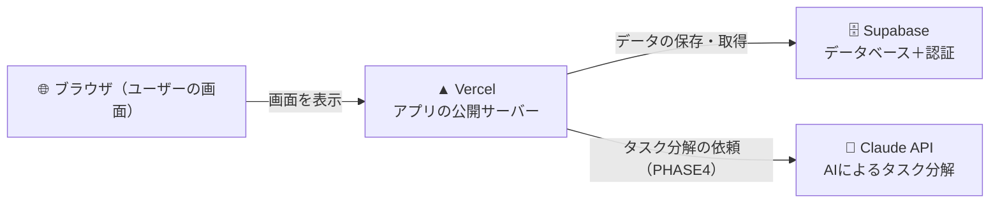

# 技術仕様書

## 使用技術一覧

| 役割 | 技術 | わかりやすく言うと |
|------|------|-----------------|
| フロントエンド | Next.js 16 (App Router) | 画面を作るための枠組み。Reactをベースにしている |
| スタイル | Tailwind CSS | クラス名を書くだけでデザインが整うツール |
| データベース | Supabase (PostgreSQL) | タスクデータを保存する場所。無料で使える |
| 認証 | Supabase Auth | メール・パスワードでのログイン機能を提供 |
| デプロイ | Vercel | GitHubにpushするだけで自動でネット公開される |
| AI機能 | Claude API (Anthropic) | タスクを30分単位に自動分解する（PHASE4で追加）|

---

## 技術の関係図



---

## フォルダ構成

```
todo-app/
├── app/
│   ├── page.tsx              ← メイン画面（タスク一覧）
│   ├── auth/
│   │   └── page.tsx          ← ログイン・サインアップ画面
│   └── api/
│       └── tasks/
│           ├── route.ts      ← タスクのAPI（追加・取得・更新・削除）
│           └── subtasks/
│               └── route.ts  ← サブタスクのAPI
├── middleware.ts              ← ログイン状態を全ページでチェック
├── docs/                      ← 設計ドキュメント
├── .steering/                 ← 作業メモ
└── .env.local                 ← 秘密の設定ファイル（GitHubに上げない）
```

---

## 環境変数（`.env.local` に書く設定）

> **環境変数とは？**
> APIキーなどの秘密情報を安全に管理する仕組みです。
> `.env.local` に書いておくと、コードの中から使えるようになります。
> このファイルは **絶対にGitHubにアップしない** こと。

```
NEXT_PUBLIC_SUPABASE_URL=（SupabaseのプロジェクトURL）
NEXT_PUBLIC_SUPABASE_ANON_KEY=（SupabaseのAPIキー）
ANTHROPIC_API_KEY=（Claude APIのキー。PHASE4で追加）
```

---

## 開発フェーズと使う技術

| フェーズ | 内容 | 使う技術 |
|---------|------|---------|
| PHASE1 | UIを作る | Next.js, Tailwind CSS |
| PHASE2 | DBと繋ぐ | Supabase（DB） |
| PHASE2.5 | ログイン機能 | Supabase Auth, middleware.ts |
| PHASE3 | ネット公開 | GitHub, Vercel |
| PHASE4 | AI機能追加 | Claude API |
