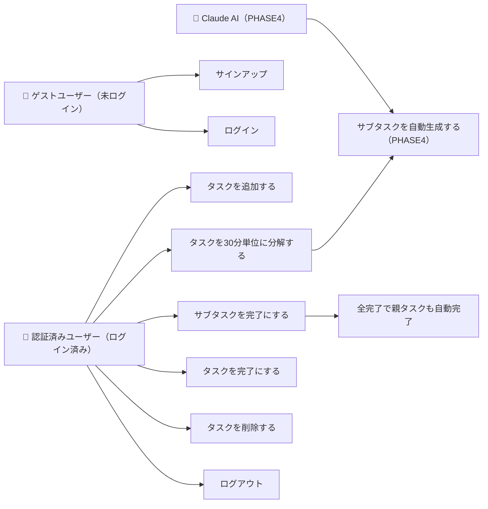
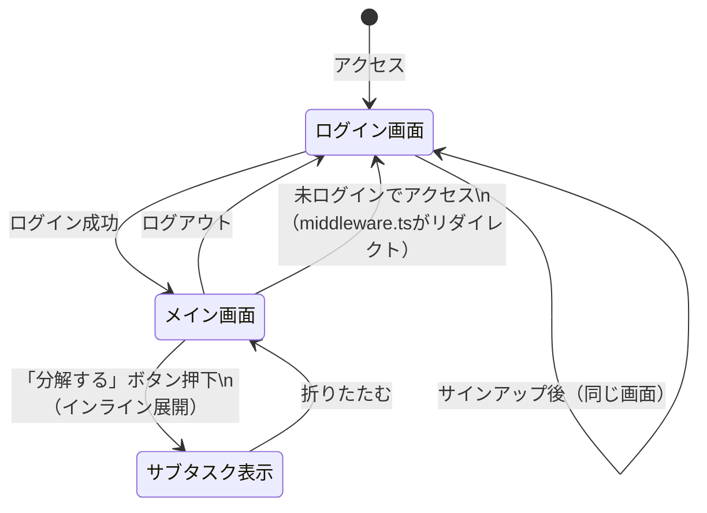
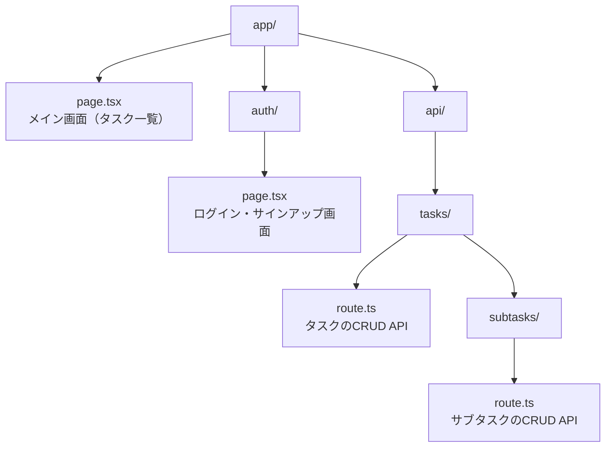
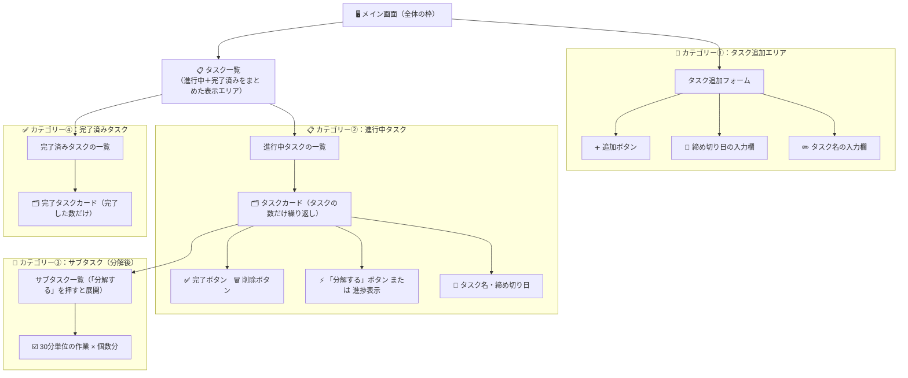

# 機能設計書

---

## 1. ユースケース図



---

## 2. 画面遷移図



---

## 3. ワイヤーフレーム

### メイン画面（/）

```
┌────────────────────────────────────┐
│  タスク管理                         │
│  タスクを30分単位に分解して今すぐ着手  │
├────────────────────────────────────┤
│  ┌──────────────────────────────┐  │
│  │ 新しいタスクを追加              │  │
│  │ [タスク名を入力............]  │  │
│  │ [日付      ]  [ 追加 ]       │  │
│  └──────────────────────────────┘  │
│                                    │
│  進行中 (2)                         │
│  ┌──────────────────────────────┐  │
│  │ 企画書を書く    締切: 3/25    │  │
│  │ [分解する] [完了] [削除]      │  │
│  └──────────────────────────────┘  │
│  ┌──────────────────────────────┐  │
│  │ 請求書を送る   締切: 3/22    │  │
│  │ [1/4]  [完了] [削除]         │  │
│  │  ─────────────────────────  │  │
│  │  ● 【30分】内容を整理する ✓  │  │
│  │  ○ 【30分】素材を集める      │  │
│  │  ○ 【30分】ドラフトを作る    │  │
│  │  ○ 【30分】見直して仕上げる  │  │
│  └──────────────────────────────┘  │
│                                    │
│  完了済み (1)                        │
│  ┌──────────────────────────────┐  │
│  │ ~~会議の準備~~        [削除]  │  │
│  └──────────────────────────────┘  │
└────────────────────────────────────┘
```

### ログイン・サインアップ画面（/auth）

```
┌────────────────────────────────────┐
│  ログイン / サインアップ              │
│                                    │
│  [メールアドレス.................]  │
│  [パスワード...................]   │
│                                    │
│  [ ログイン ]                       │
│  [ サインアップ ]                    │
└────────────────────────────────────┘
```

---

## 4. コンポーネント設計

### ファイル構成



### コンポーネント構成（画面の部品の組み立て方）

> 画面は「部品（コンポーネント）」の組み合わせで作られています。
> レゴブロックのように、小さな部品を組み合わせて1つの画面を作るイメージです。



---

## 5. データモデル定義

### tasks テーブル

| カラム名 | 型 | 制約 | 説明 |
|---------|-----|------|------|
| id | uuid | PK, default: gen_random_uuid() | 一意のID |
| user_id | uuid | FK → auth.users.id | 所有ユーザー（RLS用） |
| title | text | NOT NULL | タスク名 |
| due_date | date | NULL許容 | 締め切り日 |
| is_completed | boolean | default: false | 完了フラグ |
| created_at | timestamp | default: now() | 作成日時 |

### subtasks テーブル

| カラム名 | 型 | 制約 | 説明 |
|---------|-----|------|------|
| id | uuid | PK, default: gen_random_uuid() | 一意のID |
| task_id | uuid | FK → tasks.id | 親タスクのID |
| title | text | NOT NULL | サブタスク名（30分単位） |
| is_completed | boolean | default: false | 完了フラグ |
| order | integer | NOT NULL | 表示順 |

### リレーション

```
auth.users
  └── 1対多 ── tasks
                 └── 1対多 ── subtasks
```

---

## 6. API設計

### タスク API（/api/tasks）

| メソッド | パス | 説明 |
|---------|------|------|
| GET | /api/tasks | タスク一覧を取得 |
| POST | /api/tasks | タスクを新規追加 |
| PATCH | /api/tasks?id={id} | タスクを更新（完了フラグなど） |
| DELETE | /api/tasks?id={id} | タスクを削除 |

### サブタスク API（/api/tasks/subtasks）

| メソッド | パス | 説明 |
|---------|------|------|
| GET | /api/tasks/subtasks?task_id={id} | サブタスク一覧を取得 |
| POST | /api/tasks/subtasks | サブタスクをまとめて登録 |
| PATCH | /api/tasks/subtasks?id={id} | サブタスクを更新（完了フラグ） |

### リクエスト／レスポンス例

**POST /api/tasks**
```json
// リクエスト
{ "title": "企画書を書く", "due_date": "2026-03-25" }

// レスポンス
{ "id": "uuid", "title": "企画書を書く", "due_date": "2026-03-25", "is_completed": false }
```

**POST /api/tasks/subtasks**
```json
// リクエスト
{
  "task_id": "uuid",
  "subtasks": [
    { "title": "【30分】内容を整理する", "order": 1 },
    { "title": "【30分】素材を集める", "order": 2 }
  ]
}
```

---

## 7. 機能ごとのアーキテクチャ

### タスク追加フロー

```
ユーザー入力
  → フロントエンド（page.tsx）
  → POST /api/tasks
  → Supabase（tasks テーブルに INSERT）
  → レスポンス受け取り
  → 画面に即時反映
```

### タスク分解フロー（PHASE1：仮データ）

```
「分解する」ボタン押下
  → フロントエンドで固定の4ステップを生成
  → 画面にインライン表示
```

### タスク分解フロー（PHASE4：AI連携後）

```
「分解する」ボタン押下
  → POST /api/tasks/decompose
  → Claude API にタスク名を送信
  → AIが30分単位のサブタスクを返答
  → Supabase（subtasks テーブルに INSERT）
  → 画面にインライン表示
```

### ログイン・認証フロー

```
ユーザーがログイン画面でメール・パスワードを入力
  → Supabase Auth でセッション発行
  → middleware.ts が全ページのアクセス時にセッションをチェック
  → 未ログイン → /auth にリダイレクト
  → ログイン済み → そのままページを表示
```

---

## 8. システム構成図

```
[ブラウザ]
    │
    │ HTTPS
    ▼
[Vercel] ── Next.js アプリ
    │            ├── app/page.tsx         （メイン画面）
    │            ├── app/auth/page.tsx    （ログイン画面）
    │            ├── app/api/tasks/       （APIルート）
    │            └── middleware.ts        （認証チェック）
    │
    │ HTTPS（Supabase SDK）
    ▼
[Supabase]
    ├── PostgreSQL DB
    │     ├── tasks テーブル
    │     └── subtasks テーブル
    ├── Auth（メール・パスワード認証）
    └── RLS（ユーザーごとのデータ分離）

    │ HTTPS（PHASE4）
    ▼
[Anthropic Claude API]
    └── タスク分解の提案を生成
```
